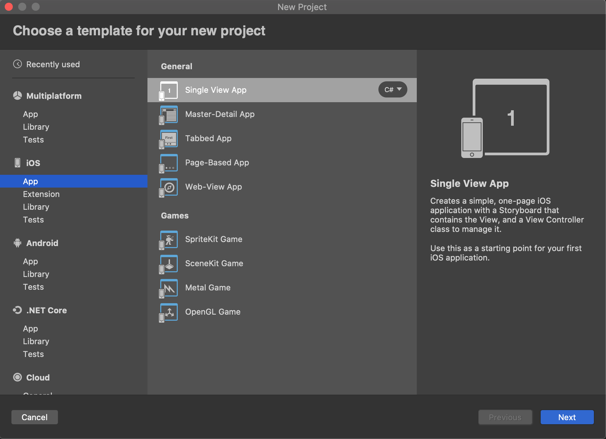
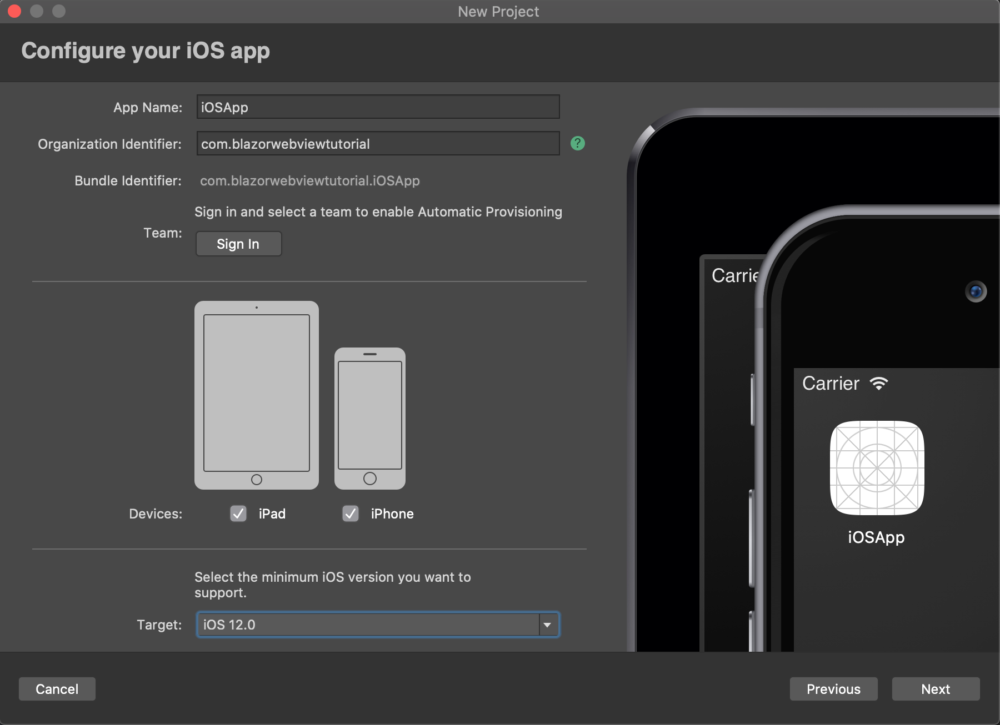
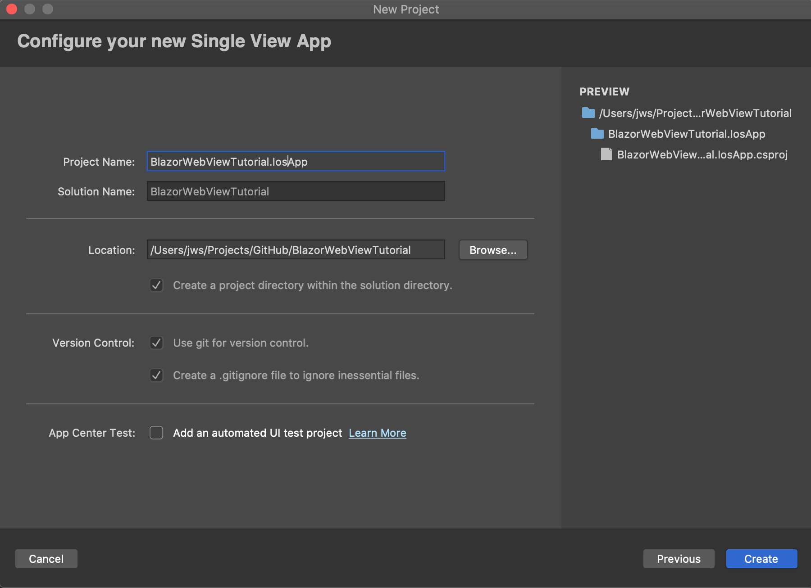

# BlazorWebView iOS Tutorial.

We will base our iOS App on the [preparations](prepare.md) we have done before.
The preparations involved bringing over our Blazor App into a Razor Class Library (RCL).
This way we can share all of the application code between all the native apps we are
creating in these tutorials. The code for the start can be found in
[this branch](https://github.com/jspuij/BlazorWebViewTutorial/tree/1_prepare).

## Add a Xamarin iOS Project.

Let's start by adding a Xamarin iOS Project to the solution. Perform the following
steps to add a new iOS Project to the solution. Right click on the solution node in
the Solution Explorer and select `Add` -> `New project...`. This will open the following
dialogs:

# [Add iOS Project 1](#tab/addios-1)



# [Add iOS Project 2](#tab/addios-2)



# [Add iOS Project 3](#tab/addios-3)



***

Make sure you choose the Single View iOS App Template and not the Multiplatform Xamarin Forms iOS Template for this tutorial. Enter all other details as indicated. 
A new project will be added to the solution. Set the iOS Project as the startup project
and Press Cmd+Enter to start the iOS Simulator and make sure everything works before we start adding the Blazor bits to the iOS Project. You can keep the Simulator running, it
is a lot faster to debug this way if neccessary.

> It is possible to use native view in a Xamarin Forms app. It is however outside of
the scope of this tutorial. More information can be found in the 
[xamarin documentation](https://docs.microsoft.com/en-us/archive/msdn-magazine/2016/connect/mobile-embedding-native-views-in-your-xamarin-forms-apps)

## Add References.

We start by adding a reference to the Shared project from the iOS Project. Click
right on the references node of the iOS Project and select `Add reference...`.
Select the shared RCL Project from the projects list and click "OK".

Now that we have references the Shared RCL Project, it's time to install the NuGet
package for the BlazorWebView for iOS. Select the project in the Solution Explorer,
and subsequently click `Project` in the top menu and then `Manage NuGet Packages...`

Check `Show pre-release packages` and search for `BlazorWebView.iOS'. Add it to the project.
This should install the package. We need an `HttpClient` for this platform, 
so we install `System.Net.Http` from NuGet as well.

Optionally you can update the Xamarin.Essentials NuGet package in the project, because
the default template comes with a very old version. Rebuild the project, 
there should be no build errors.

> There are a number of build warnings however, warning MSB3277: Found conflicts between different
versions of "System.Numerics.Vectors" that could not be resolved. This is because of
the incompatibility of `System.Text.Json` on Xamarin platforms. Two bugs are tracked
[here](https://github.com/xamarin/Essentials/issues/904) and
[here](https://github.com/dotnet/runtime/issues/31326). The use of the Serializer luckily
is limited enough that Blazor works on iOS. You are encouraged to use Newtonsoft JSON for
now if you want to do serialization for HTTP calls and you experience issues.

Lets continue to the next step.

## Copy `wwwroot` Files.

We need a `wwwroot` folder and an `index.html` for this project as well. Let's copy the wwwroot
folder from the WebAssembly client project to the iOS project to the Resources folder. Use alt to copy the folder, it will display a plus-symbol. The project should look like this:


> The wwwroot folder from the iOS Project will be combined with the Static Assets of
the Razor Class Libraries into a folder inside the App-Bundle.

## Change `index.html`.

We need to change the name and location where the framework script is loaded from.
BlazorWebView will intercept URLs loaded from the `framework://` scheme and present the
content directly to the native operating webview. We will load the Blazor JavaScript
file from the following location:

`framework://blazor.desktop.js`

Change the index.html file inside the wwwroot folder of the iOS Project to read:

```html
<!DOCTYPE html>
<html>

<head>
    <meta charset="utf-8" />
    <meta name="viewport" content="width=device-width, initial-scale=1.0, maximum-scale=1.0, user-scalable=no" />
    <title>BlazorWebViewTutorial.Client</title>
    <base href="/" />
    <!-- Add _content/BlazorWebViewTutorial.Shared below -->
    <link href="_content/BlazorWebViewTutorial.Shared/css/bootstrap/bootstrap.min.css" rel="stylesheet" />
    <link href="_content/BlazorWebViewTutorial.Shared/css/site.css" rel="stylesheet" />
</head>

<body>
    <app>Loading...</app>

    <div id="blazor-error-ui">
        An unhandled error has occurred.
        <a href="" class="reload">Reload</a>
        <a class="dismiss">🗙</a>
    </div>
    <!-- change the script location -->
    <script src="framework://blazor.desktop.js"></script>
</body>

</html>
```

## Prepare the Main Storyboard and View Controller.

The iOS App has a single View Controller that is called ViewController. It consists of two
parts:

* A Storyboard file called "Main.storyboard" inside the root folder
  of the iOS App project.
* The "ViewController.cs" file in the same root folder.

We need to update the first to add the Blazor Web View to the Storyboard, then we
update the second one to wire up the Blazor Web View to show our Blazor App.

### Add the BlazorWebView Control.

Open the "Main.storyboard" file by double clicking it. We need to add a Blazor Web View to
the view inside, where the Blazor content will be rendered. Search for the Blazor Web View
inside the toolbox and drag it to add it to the view:


The Blazor Web View will appear in the middle of the View. Center align and fill the View
using the dialog below:


Make sure you click all the Auto Size edges and inside to make sure that the View sizes with
its parent. Finally give the Blazor Web View the name "BlazorWebView" using the Properties dialog below:


We have added a View with the type `BlazorWebView.iOS.BlazorWebView`, that matches
its parent in height and width, and we have given it the `BlazorWebView` Name. We will need
that Name later to reference the View in the `ViewController.cs` file.
Close the Designer and build the project, it should still build. The Designer will have created
a BlazorWebView Outlet inside the `ViewController.Designer.cs` file.

### Wire up the Blazor Web View.

Open the `ViewController.cs` file in the Text Editor. First we need to add two namespaces
<em>inside</em> the namespace of the file (to avoid naming conflicts) like so:

```csharp
namespace BlazorWebViewTutorial.IosApp
{
    // add usings here
    using BlazorWebView.iOS;
    using BlazorWebView;
```

To be able to dispose of the BlazorWebViewHost we add a private field to the class:

```csharp
    public partial class ViewController : UIViewController
    {
        private IDisposable disposable;
```

Now, we are ready to use the BlazorWebView Outlet to initialize Blazor.
We do this by adding the following statement to the `ViewDidLoad` method of the class:

```csharp
            // run blazor.
            this.disposable = BlazorWebViewHost.Run<Startup>(this.BlazorWebView, "wwwroot/index.html");
```

The line will start Blazor. We'll take it apart step by step, to see what is going on:

* The result of the assignment is a Disposable instance that can be used to tear down and cleanup blazor. We should save it
  and call dispose when the View is unloaded. 
* We start Blazor by calling the Run method on the `BlazorWebViewHost` static class. The run method takes a Generic type that
  specifies the Startup class that will initialize Blazor. We still use a Startup class, although Blazor WebAssembly has moved
  away from it. This might change in the future, but for now we keep the Startup class. We will define a Startup class in the
  next chapter.
* The first argument to the run method is the `IBlazorWebView` instance for the platform that we will use. In this case, it's
  the BlazorWebView instance that we got from the Outlet. 
* The second argument is the relative path to the `index.html` resource inside the project. It usually is index.html and it has
  to be the `wwwroot` folder. The wwwroot folder is copied from the Resources folder to the Bundle on build.

We have to make sure that we clean up nicely when the Parent View is destroyed, so we add the following line to the `DidReceiveMemoryWarning` method inside the `ViewController.cs` file:
class:

```csharp
        public override void DidReceiveMemoryWarning()
        {
            if (this.disposable != null)
            {
                this.disposable.Dispose();
                this.disposable = null;
            }

            base.DidReceiveMemoryWarning();
        }
```

After we have done this the final version of the `ViewController.cs` should look like this:

```csharp
using Foundation;
using System;
using UIKit;

namespace BlazorWebViewTutorial.IosApp
{
    // add usings here
    using BlazorWebView.iOS;
    using BlazorWebView;

    public partial class ViewController : UIViewController
    {
        private IDisposable disposable;

        public ViewController(IntPtr handle) : base(handle)
        {
        }

        public override void ViewDidLoad()
        {
            base.ViewDidLoad();

            // run blazor.
            this.disposable = BlazorWebViewHost.Run<Startup>(this.BlazorWebView, "wwwroot/index.html");
        }

        public override void DidReceiveMemoryWarning()
        {
            if (this.disposable != null)
            {
                this.disposable.Dispose();
                this.disposable = null;
            }

            base.DidReceiveMemoryWarning();
        }
    }
}
```

Well done, you've implemented the ViewController, so we can move on to the final bit of this tutorial, which
is implementing the `Startup` class.

## Implement the Startup Class.

We have to wire up the Blazor Dependency Injection and define the root App class for Blazor to be able to run.
This Startup class closely resembles the AspnetCore default startup class for a web application.
We could define it in the Shared RCL Project, but as it most likely will contain DI registrations specific to
the platform, a better place is the iOS Project. Let's add the following class to the iOS Project:

```csharp
using System.Net.Http;

using BlazorWebView;
using BlazorWebViewTutorial.Shared;
using Microsoft.Extensions.DependencyInjection;

namespace BlazorWebViewTutorial.IosApp
{
    public class Startup
    {
        public void ConfigureServices(IServiceCollection services)
        {
            services.AddScoped<HttpClient>();
        }

        /// <summary>
        /// Configure the app.
        /// </summary>
        /// <param name="app">The application builder for apps.</param>
        public void Configure(ApplicationBuilder app)
        {
            app.AddComponent<App>("app");
        }
    }
}
```

The startup class has two methods. The first method configures the services
for the DI container. We add an `HttpClient` from System.Net.Http as the
iOS Platform does not come with a built-in one.

The second method is the configuration for the platform. The method accepts
an `ApplicationBuilder` that can be used to add the root component for the
app.

Press Cmd+Enter to build and run the project. You should be greeted by a familiar
Blazor application:


## Fix the Last Runtime Issue.

When you navigate to the `Fetch-Data` Page, you'll notice that the data is no
longer shown. The data is included inside the iOS APK, but the `HttpClient`
that we have added to the DI container is outside of the Browser and won't be
intercepted by the BlazorWebView. Let's get the data from Github directly
to solve this issue. Change the `Oninitialized` method inside `FetchData.Razor`
component in the shared RCL project to read:

```csharp
    protected override async Task OnInitializedAsync()
    {
        forecasts = await Http.GetFromJsonAsync<WeatherForecast[]>("https://raw.githack.com/jspuij/BlazorWebViewTutorial/master/BlazorWebViewTutorial.Shared/wwwroot/sample-data/weather.json");
    }
```

The iOS App should now be fully functioning. The source for the iOS App
is in this branch:

https://github.com/jspuij/BlazorWebViewTutorial/tree/2_ios
