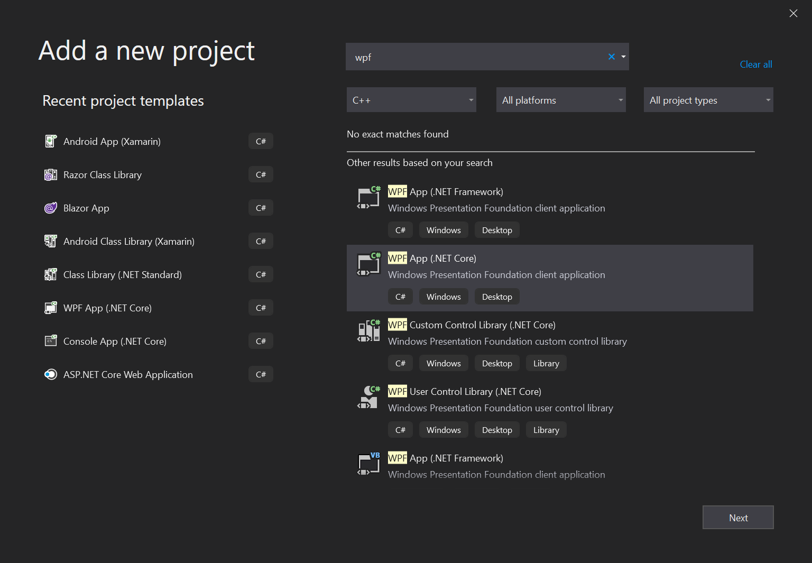
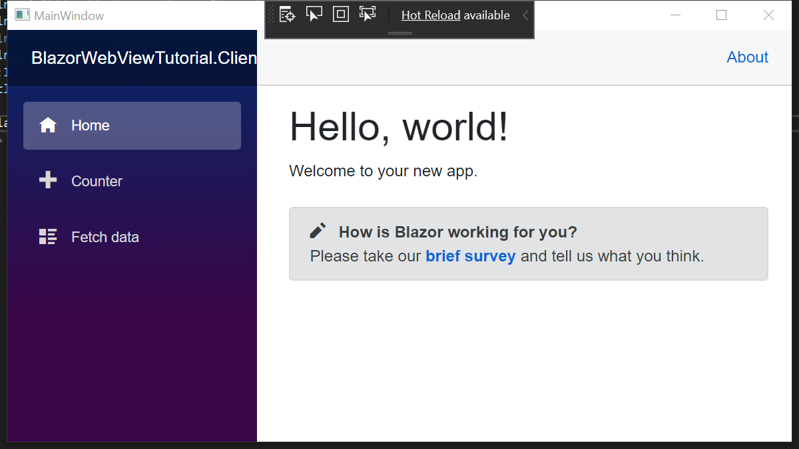

# BlazorWebView WPF Tutorial.

We will base our WPF App on the [preparations](prepare.md) we have done before.
The preparations involved bringing over our Blazor App into a Razor Class Library (RCL).
This way we can share all of the application code between all the native apps we are
creating in these tutorials. The code for the start can be found in
[this branch](https://github.com/jspuij/BlazorWebViewTutorial/tree/1_prepare).

> Due to the Coronavirus Edge 82 (based on Chrome 82) has not been released. This is
unfortunate, because this project has been upgraded to the latest Edge SDK in anticipation
of its release. For now you can use this Control with the Dev / Canary builds of Edge, or
use it with the old Edge. It will fall back to the old Edge automatically.

## Add a WPF .NET Core Project.

Let's start by adding a WPF .NET Core Project to the solution. Perform the following
steps to add a new WPF Project to the solution. Right click on the solution node in
the Solution Explorer and select `Add` -> `New project...`. This will open the following
dialogs:

# [Add WPF Project 1](#tab/addwpf-1)



# [Add WPF Project 2](#tab/addwpf-2)


***


Make sure you choose the .NET Core WPF App Template and not the .NET Framework WPF
Template for this tutorial. Blazor cannot run on the classic .NET Framework, as it
is not netstandard 2.1 compatible. Finally, select the "Blank App" Template in the final dialog.
A new project will be added to the solution. Set the WPF Project as the startup project
and Press F5 to start the WPF Application and make sure everything works before we start
adding the Blazor bits to the WPF Project.

## Add References.

We start by adding a reference to the Shared project from the WPF Project. Click
right on the Dependencies node of the WPF Project and select `Add reference...`.
Select the shared RCL Project from the projects list and click "OK".

Now that we have references the Shared RCL Project, it's time to install the NuGet
package for the BlazorWebView for WPF. Enter the following lines into the Package
Console:

```
PM> Install-Package BlazorWebView.Wpf -IncludePrerelease
```

This should install the package. We need an `HttpClient` for this platform, 
so we install `System.Net.Http` from NuGet:

```
PM> Install-Package System.Net.Http
```

Build the project to make sure that there are no warnings or errors. Lets continue to the next step.

## Copy `wwwroot` Files.

We need a `wwwroot` folder and an `index.html` for this project as well. Let's copy the wwwroot
folder from the WebAssembly client project to the WPF project. Now that we have added
the wwwroot folder with the index.html file (and favicon to prevent a 404), we have to change
the properties of these files:

* Change <strong>BuildAction</strong> from `Content` to `None`
* Change <strong>Copy To Output directory</strong> from `Do not Copy` to `Copy if newer`

The project should look like this:


> The wwwroot folder from the WPF Project will be combined with the Static Assets of
the Razor Class Libraries into a wwwroot folder in the output directory. The Static Assets
end up in the `_content/` subfolder.

## Change `index.html`.

We need to change the name and location where the framework script is loaded from.
BlazorWebView will intercept URLs loaded from the `framework://` scheme and present the
content directly to the native operating webview. We will load the Blazor JavaScript
file from the following location:

`framework://blazor.desktop.js`

Change the index.html file inside the wwwroot folder of the WPF Project to read:

```html
<!DOCTYPE html>
<html>

<head>
    <meta charset="utf-8" />
    <meta name="viewport" content="width=device-width, initial-scale=1.0, maximum-scale=1.0, user-scalable=no" />
    <title>BlazorWebViewTutorial.Client</title>
    <base href="/" />
    <!-- Add _content/BlazorWebViewTutorial.Shared below -->
    <link href="_content/BlazorWebViewTutorial.Shared/css/bootstrap/bootstrap.min.css" rel="stylesheet" />
    <link href="_content/BlazorWebViewTutorial.Shared/css/site.css" rel="stylesheet" />
</head>

<body>
    <app>Loading...</app>

    <div id="blazor-error-ui">
        An unhandled error has occurred.
        <a href="" class="reload">Reload</a>
        <a class="dismiss">🗙</a>
    </div>
    <!-- change the script location -->
    <script src="framework://blazor.desktop.js"></script>
</body>

</html>
```

## Prepare the Main Window.

The WPF App has a single window that is called MainWindow. It consists of two
parts:

* A XAML file called "MainWindow.xaml" inside the root folder of the project.
* The "MainWindow.xaml.cs" file in the file behind the "MainWindow.xaml" file.

We need to update the first to add the "BlazorWebView" control to the window, then we
update the second one to wire up the BlazorWebView to show our Blazor App.

### Add the BlazorWebView Control.

Open the "MainWindow.xaml" file by double clicking it. We need to add a Control to
it, where the Blazor content will be rendered. The file should read like this when done:

```xml
<Window x:Class="BlazorWebViewTutorial.WpfApp.MainWindow"
        xmlns="http://schemas.microsoft.com/winfx/2006/xaml/presentation"
        xmlns:x="http://schemas.microsoft.com/winfx/2006/xaml"
        xmlns:d="http://schemas.microsoft.com/expression/blend/2008"
        xmlns:mc="http://schemas.openxmlformats.org/markup-compatibility/2006"
        xmlns:local="clr-namespace:BlazorWebViewTutorial.WpfApp"
        xmlns:blazor="clr-namespace:BlazorWebView.Wpf;assembly=BlazorWebView.Wpf"
        mc:Ignorable="d"
        Title="MainWindow" Height="450" Width="800" ContentRendered="Window_ContentRendered" Closing="Window_Closing">
    <Grid>
        <blazor:BlazorWebView x:Name="BlazorWebView" />
    </Grid>
</Window>
```

To be able to use the control, we first have to import the types into a Xaml namespace, which
is done by adding the `xmlns:blazor="clr-namespace:BlazorWebView.Wpf;assembly=BlazorWebView.Wpf"`
attribute to the Window tag.
We have added the Control with the type `blazor:BlazorWebView`, that matches
its parent in height and width, and we have given it the `BlazorWebView` Name. WPF will automatically
create a property with that name on the `MainWindow` class.

> The BlazorWebView Control first tries to start the new Edge (Chromium based) Edge. If it's not encountered
the BlazorWebView Control will fall back to the old Edge control. If this is not desired you can use the
`BlazorNewEdgeWebView` and `BlazorOldEdgeWebView` Controls respectively.

We have also added two event handlers to the Window class:

* <strong>Windows_ContentRendered:</strong> This event will be used to initialize Blazor. Unfortunately
  it has to be an event that occurs after the HwndHost (that hosts the native edge window) has initialized.
  Putting the initialization code in an event handler that occurs earlier will result in exceptions.
* <strong>Window_Closing:</strong> This event will be used to tear down Blazor.

If you double click the event handler in the Property Window of the WPF Designer, Visual Studio will create
the event handlers automatically in the `MainWindow.xaml.cs` file.
Close the Designer and build the project, it should still build.

### Wire up the BlazorWebView Control.

Open the MainWindow.xaml.cs file in the Text Editor. First we need to add two namespaces
<em>inside</em> the namespace of the file (to avoid naming conflicts) like so:

```csharp
namespace BlazorWebViewTutorial.WpfApp
{
    // add usings here
    using BlazorWebView.Wpf;
    using BlazorWebView;
```

To be able to dispose of the BlazorWebViewHost and to signal that we have initialized Blazor
we add two private fields to the class:

```csharp
    public partial class MainWindow : Window
    {
        private IDisposable disposable;
        private bool initialized = false;
```

Now, we are ready to initialize Blazor, but only once!
We do this by adding the following two statements to the `Window_ContentRendered` method of the class:

```csharp
            if (!this.initialized)
            {
                this.initialized = true;
                // run blazor.
                this.disposable = BlazorWebViewHost.Run<Startup>(this.BlazorWebView, "wwwroot/index.html");
            }
```

The if-statement will make sure that we only initialize the BlazorWebView Control once.
The second inner line will start Blazor. We'll take it apart step by step, to see what is going on:

* The result of the assignment is a Disposable instance that can be used to tear down and cleanup blazor. We should save it
  and call dispose when the Window is destroyed. 
* We start Blazor by calling the Run method on the `BlazorWebViewHost` static class. The run method takes a Generic type that
  specifies the Startup class that will initialize Blazor. We still use a Startup class, although Blazor WebAssembly has moved
  away from it. This might change in the future, but for now we keep the Startup class. We will define a Startup class in the
  next chapter.
* The first argument to the run method is the `IBlazorWebView` instance for the platform that we will use. In this case, it's
  the BlazorWebView instance that we have added to the Window. 
* The second argument is the relative path to the `index.html` file inside the project. It usually is index.html and it has
  to be the `wwwroot` folder.

We have to make sure that we clean up nicely when the activity is destroyed, so we add the following code to the `Window_Closing`
method:

```csharp
            if (this.disposable != null)
            {
                this.disposable.Dispose();
                this.disposable = null;
            }
```

Now we need to resolve some usings, but after we have done this the final version of the `MainActivity.cs` should look like this:

```csharp
using System;
using System.Collections.Generic;
using System.Linq;
using System.Text;
using System.Threading.Tasks;
using System.Windows;
using System.Windows.Controls;
using System.Windows.Data;
using System.Windows.Documents;
using System.Windows.Input;
using System.Windows.Media;
using System.Windows.Media.Imaging;
using System.Windows.Navigation;
using System.Windows.Shapes;

namespace BlazorWebViewTutorial.WpfApp
{
    // add usings here
    using BlazorWebView.Wpf;
    using BlazorWebView;

    /// <summary>
    /// Interaction logic for MainWindow.xaml
    /// </summary>
    public partial class MainWindow : Window
    {
        private IDisposable disposable;
        private bool initialized = false;

        public MainWindow()
        {
            InitializeComponent();
        }

        private void Window_ContentRendered(object sender, EventArgs e)
        {
            if (!this.initialized)
            {
                this.initialized = true;
                // run blazor.
                this.disposable = BlazorWebViewHost.Run<Startup>(this.BlazorWebView, "wwwroot/index.html");
            }
        }

        private void Window_Closing(object sender, System.ComponentModel.CancelEventArgs e)
        {
            if (this.disposable != null)
            {
                this.disposable.Dispose();
                this.disposable = null;
            }
        }
    }
}
```

Well done, you've implemented the MainWindow, so we can move on to the final bit of this tutorial, which
is implementing the `Startup` class.

## Implement the Startup Class.

We have to wire up the Blazor Dependency Injection and define the root App class for Blazor to be able to run.
This Startup class closely resembles the AspnetCore default startup class for a web application.
We could define it in the Shared RCL Project, but as it most likely will contain DI registrations specific to
the platform, a better place is the WPF Project. Let's add the following class to the WPF Project:

```csharp
using System.Net.Http;

using BlazorWebView;
using BlazorWebViewTutorial.Shared;
using Microsoft.Extensions.DependencyInjection;

namespace BlazorWebViewTutorial.WpfApp
{
    public class Startup
    {
        public void ConfigureServices(IServiceCollection services)
        {
            services.AddScoped<HttpClient>();
        }

        /// <summary>
        /// Configure the app.
        /// </summary>
        /// <param name="app">The application builder for apps.</param>
        public void Configure(ApplicationBuilder app)
        {
            app.AddComponent<Shared.App>("app");
        }
    }
}
```

The startup class has two methods. The first method configures the services
for the DI container. We add an `HttpClient` from System.Net.Http as the
WPF Platform does not come with a built-in one.

The second method is the configuration for the platform. The method accepts
an `ApplicationBuilder` that can be used to add the root component for the
app.

Press F5 to build and run the project. You should be greeted by a familiar
Blazor application:



## Fix the Last Runtime Issue.

When you navigate to the `Fetch-Data` Page, you'll notice that the data is no
longer shown. The data is included inside the WPF App, but the `HttpClient`
that we have added to the DI container is outside of the Browser and won't be
intercepted by the BlazorWebView. Let's get the data from Github directly
to solve this issue. Change the `Oninitialized` method inside `FetchData.Razor`
component in the shared RCL project to read:

```csharp
    protected override async Task OnInitializedAsync()
    {
        forecasts = await Http.GetJsonAsync<WeatherForecast[]>("https://raw.githubusercontent.com/jspuij/BlazorWebViewTutorial/master/BlazorWebViewTutorial.Shared/wwwroot/sample-data/weather.json");
    }
```

The WPF App should now be fully functioning. The source for the WPF App
is in this branch:

https://github.com/jspuij/BlazorWebViewTutorial/tree/5_wpf
